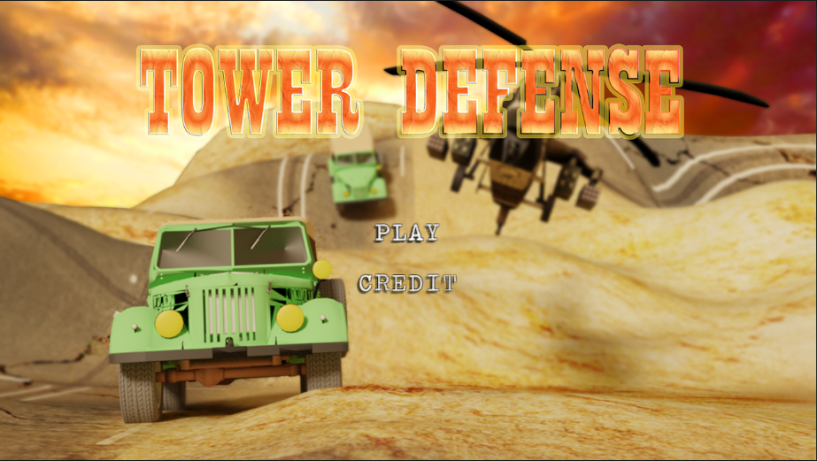
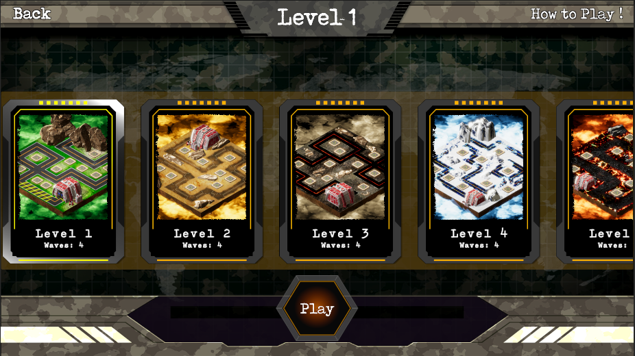
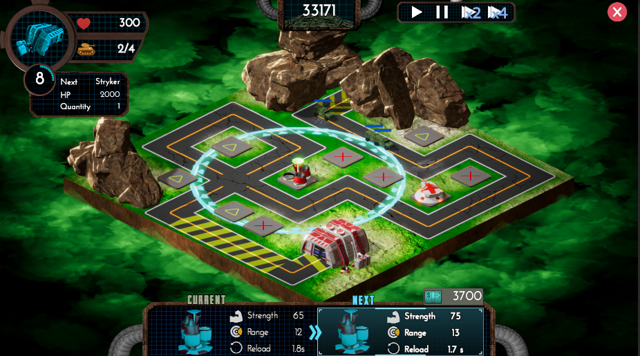
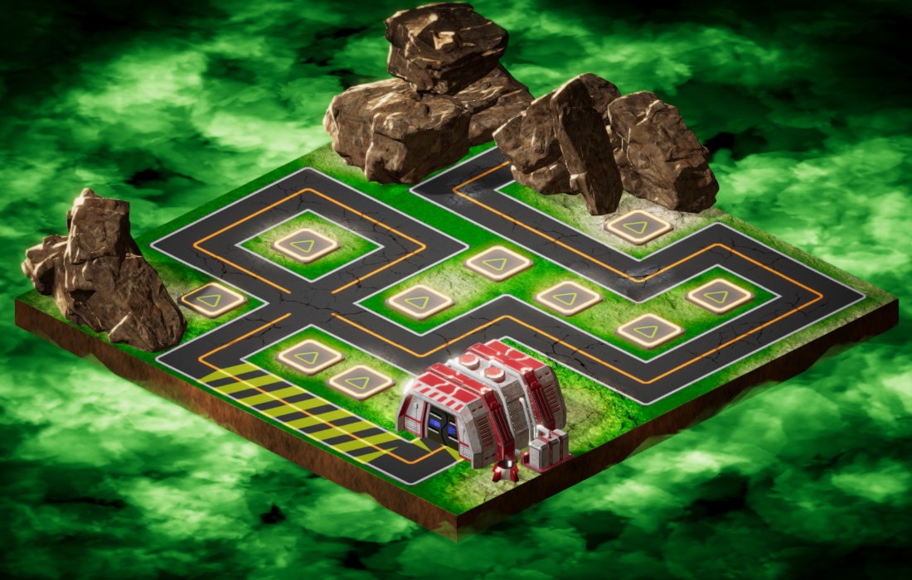
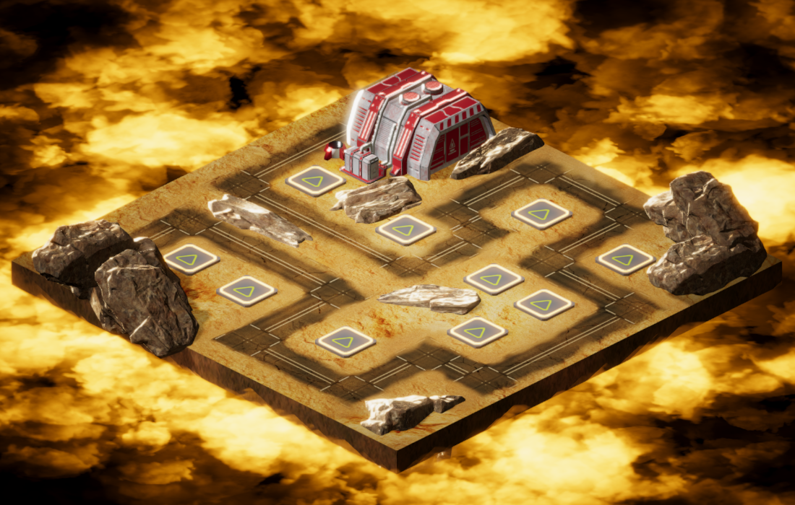
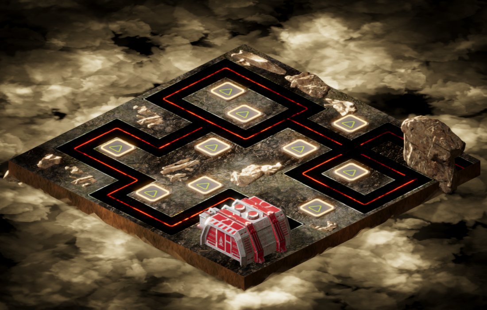
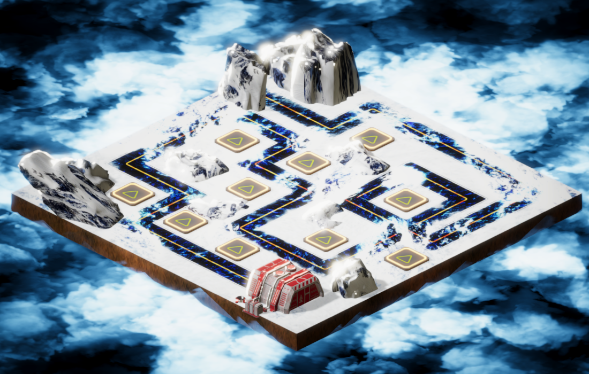
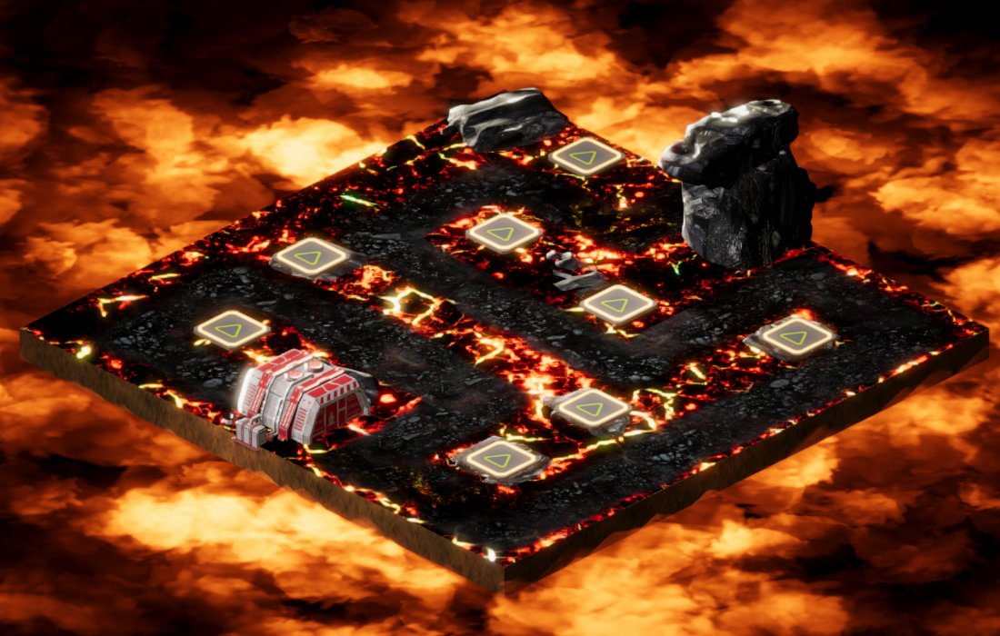
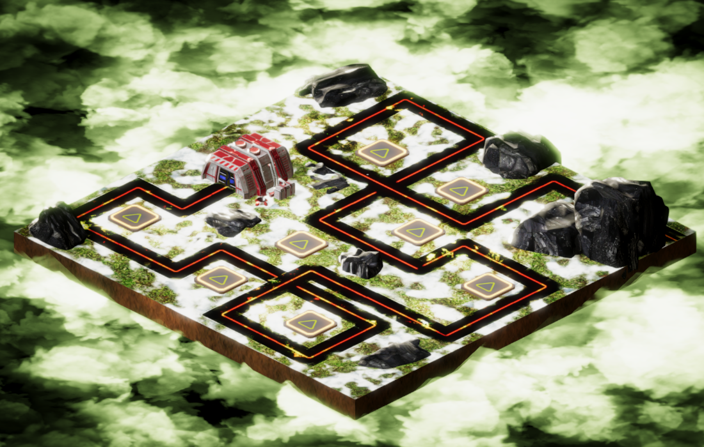

# Unity3DTowerDefense
A small Tower Defense Game which is created by Unity 3D and C# language

[Watch Demo on Youtube](https://www.youtube.com/watch?v=7tKRhQH4-fg)

***************************** <b>Stages</b> *****************************

  
<b>>> Main Menu <<</b>

  

  
  
<b>>> Level Selection <<</b>

  

  
<b>>> Game Play <<</b>

  

  
  
  
  
***************************** <b>Levels</b> *****************************

 

  
  
  
  
  
  
 

